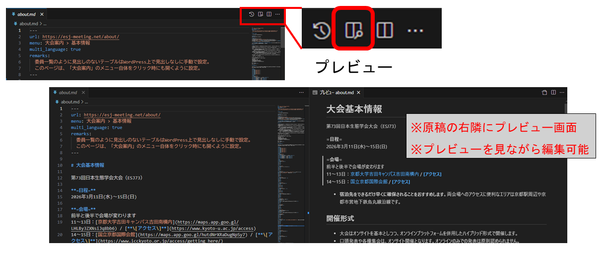

# 運営部会　作業マニュアル

## はじめに

- 運営部会では、生態学会大会のホームページの更新を、数回のメジャーアップデートに分割してスケジュール管理を行っています (ESJ73の具体的なスケジュールは[こちら](https://docs.google.com/spreadsheets/d/18cHYWecU_hidkD4OQESbGGriOVLPjBjg/edit?gid=126868849#gid=126868849)を参照)。
- 各ページの原稿の執筆は、運営部会・他部会・大会実行委員等で分担して行うことになっています。
- 複数の部署で分担する都合上、寄せられた原稿に誤りや不明瞭な点がないかをチェックすることが、運営部会の非常に重要な仕事です。
- ここでは、部会員としての一連の作業手順について、以下の内容についてまとめています。
    - 全体の流れ
    - 編集環境の準備
    - 自身の原稿の作成
    - 各部会から提出された原稿についてのチェック項目
    - 編集上の留意点

## 全体の流れ

運営部会では、以下のような複数のフェーズに分けて、ホームページの更新を行います。

- フェーズ1(7月頭): 大会の概要、および申込の早い一部集会の告知
- フェーズ2(9月末): 一般講演・各種集会の申し込みに必要な情報
- フェーズ3(12月末): 発表準備・参加に必要な情報
- フェーズ4(2月中頃): 開催準備に合わせて随時必要になる情報（実施するか検討中）

各フェーズでは、以下のようなステップを踏みます。

1. 運営部会での原稿事前チェック
    - 原稿の執筆依頼の前に各ページの記述内容をざっと確認して、読みにくい部分や変更になった点など、執筆に際して必要な注意事項を整理
    - 各部会は全体としてどのような情報をどこに掲載するのかを知らないため、放っておくと個々に記述が継ぎ足されてページが肥大化してしまう
    - 全体が見えている運営部会側で、ある程度簡略化や情報の別ページへの集約等を進めてしまう
2. 各部会への原稿執筆依頼
    - 運営部会が実際に執筆を担当するのは、おおよそ全ページの半数ほど（[このページ](https://docs.google.com/spreadsheets/d/18cHYWecU_hidkD4OQESbGGriOVLPjBjg/edit?gid=126868849#gid=126868849)の青色と紫の一部）で、残りは他部会が担当しています
    - 1で整理した内容をもとに、各部会に原稿の執筆依頼を行います
3. 運営部会内での執筆作業
    - 運営部会内での執筆は、各ページの内容を確認しながら、必要な情報を追加・修正していきます
    - 執筆に必要な情報は部会長が中心となって収集・整理しています。情報の齟齬や未検討の点が出てきた場合、企画委員会内で改めて議論が必要となることもあるため、執筆の際にはその点も留意してください。
4. 運営部会レビュー
    - 各部会に依頼した原稿および運営部会内で執筆した原稿を集約し、部会員で分担しながら記述内容をチェックします（後述）
    - 他部会の担当分については記述内容の正確さまでは確認する必要はありませんが、情報に齟齬がないか、記述内容に不明瞭な点がないか、誤字脱字がないか等は確認します。
5. 企画委員会での全体レビュー
    - 原稿を非公開の編集用Webサイト（edit版）にアップロードし、そのWebサイトを企画委員会のメンバー全員で確認します。
    - 運営部会員はしばしのお休みです
6. 全体レビューコメント反映作業
    - 全体レビューで集まったコメントを原稿に反映します。
    - 各部会への依頼分については担当部会にページを差し戻してもよいのですが、逆に手間がかかることから軽微な変更であれば運営部会内で行ってしまう方が楽です。
7. 最終確認
    - 全体レビューのコメント反映後の最終稿を非公開の編集用Webサイト（edit版）にアップロードし、改めて企画委員会のメンバー全員で確認します。
8. Webサイト公開
    - Web担当がWordpress環境を編集用Webサイト（edit版）から本番用Webサイトへとコピーすることで、本番環境に反映します。

上記のうち、運営部会員が実際に原稿の編集を担当するのは、1,3,4,6の部分です。以下では、この編集作業のための環境準備と留意点について説明します。

## 編集環境の準備

原稿の編集に使用するのは二種類です。

- Webページの原稿はMarkdown（mdとも略されます）を使用していため、Markdown形式を編集できる環境が必要です。
- 原稿はgitと呼ばれるバージョン管理ツールで管理されています。

gitは必ず必要なわけではありませんが、gitを使うことで、他の人が編集した原稿を取り込んだり、過去の編集履歴を参照したりすることが容易になります。以下、gitを使用する場合と使用しない場合についてそれぞれ説明します。

### 1.gitを使用する場合

gitについてよく知らない場合は、まず以下のページの解説を一通り参照しておくことをお勧めします。  
[【git入門】](https://hmito.github.io/learning/git)

1. VSCodeおよびgitを使える環境を準備する。お勧めは[このページ](https://hmito.github.io/learning/git/setup.html)に沿った準備。
2. GitHubに[アカウントを作成](https://hmito.github.io/learning/git/setup.html#%E3%83%9B%E3%82%B9%E3%83%86%E3%82%A3%E3%83%B3%E3%82%B0%E3%82%B5%E3%83%BC%E3%83%93%E3%82%B9%E3%81%AE%E3%82%A2%E3%82%AB%E3%82%A6%E3%83%B3%E3%83%88%E3%81%AE%E7%94%A8%E6%84%8F)。すでに持っていればスキップしてよい。
3. esj73webのgit管理者にGitHubアカウントの「メールアドレス」もしくは「ユーザー名」を連絡して、 esj73webリポジトリ（リポジトリ=履歴管理の単位）の共同編集者に招待してもらう。
4. 共同編集者に招待されたら、[「リモートにすでにリポジトリがある」ケース](https://hmito.github.io/learning/git/remote.html#%E3%82%B1%E3%83%BC%E3%82%B92%E3%83%AA%E3%83%A2%E3%83%BC%E3%83%88%E3%81%AB%E3%81%99%E3%81%A7%E3%81%AB%E3%83%AA%E3%83%9D%E3%82%B8%E3%83%88%E3%83%AA%E3%81%8C%E3%81%82%E3%82%8B)を参考に、リポジトリをクローンする。
    - なお、**リモートリポジトリのURL**は以下の通り。このURLをコピーしたら、リンク先のステップ1を飛ばしてステップ2から進める  
    `https://github.com/hmito/esj73web.git`
5. クローンしたリポジトリのフォルダをVSCodeで開く（メニューバーの「ファイル」→「フォルダを開く」）。
6. ブランチを作業用の「phaseX」(Xは1,2,3,4のいずれか)に切り替える。
    - ブランチの切り替えは、VSCodeの左下にある「main」などと書かれた部分をクリックして、表示されるメニューから切り替えたいブランチ（origin/phaseX）を選択する。
    - VSCodeの左下にある「main」などと書かれた部分が「phaseX」に変わっていれば、切り替え成功。
7. 編集したい原稿ファイルをVSCodeで開く。
    - VSCodeの基本的な使い方は、[このページ](https://hmito.github.io/learning/vscode.html)を参照。
8. 編集が終わったら、VSCodeの左メニューの「ソース管理」アイコン（丸3つが線でつながれたマーク）をクリックし、編集したファイルを選択して「+」ボタンを押してステージし、変更内容を簡単に日本語で記述して「コミット」を押す（このあたりの作業は、[このページ](https://hmito.github.io/learning/git/commit.html#%E3%83%95%E3%82%A1%E3%82%A4%E3%83%AB%E3%81%AE%E5%A4%89%E6%9B%B4)参照）。
9. コミットが終わったら、VSCodeの左メニューの「ソース管理」アイコンをクリックし、上部にある「…」をクリックして「プッシュ」を選択する（このあたりの作業は、[このページ](https://hmito.github.io/learning/git/remote.html#%E5%90%8C%E6%9C%9F%E3%83%97%E3%83%83%E3%82%B7%E3%83%A5%E3%81%A8%E3%83%97%E3%83%AB)参照）。
    - エラーが出たら、おそらく編集内容が他者と競合コンフリクトしている。[このページ](https://hmito.github.io/learning/git/merge.html#%E7%B7%A8%E9%9B%86%E3%81%AE%E7%AB%B6%E5%90%88%E3%82%B3%E3%83%B3%E3%83%95%E3%83%AA%E3%82%AF%E3%83%88)を参考に、競合を解決する。
10. 7-9の手順を繰り返すことで、原稿の編集を行う。

### 2.gitを使用しない場合

1. Markdown形式の原稿を編集できるエディタを用意する。
    - お勧めは[Visual Studio Code (VSCode)](https://code.visualstudio.com/)。インストールと使い方は、[このページ](https://hmito.github.io/learning/vscode.html)参照。
    - RStudioでも表示・編集可能。
2. esj73webのgit管理者から、原稿のダウンロード用のURLをもらう。
3. 原稿をダウンロードし編集作業を行う。
4. 編集が終わったら、原稿をSlackの運営部会チャンネルにアップロードし、取り込みを依頼する。

### ※VScodeのプレビュー機能について

各原稿の右上にあるプレビューボタンをクリックすると、編集画面とは別タブでMarkdownのプレビューが表示されます。各種変更が正しく反映されているかをチェックしながら編集できるため非常に便利ですので、使用を推奨します。



## 編集におけるチェック項目

主に他部会や自分以外の運営部会員が執筆した原稿をレビューするうえでのチェック項目を記載します (もちろん自身が執筆する原稿についてもチェックしてください)。

なお、Markdown記法自体の解説はdocs内の[マニュアル (markdown_manual.md)](markdown_manual.md)を参照してください。


### 1. yamlヘッダのチェック

yamlヘッダとは各ページの上部にある2つの"---"で挟まれた部分で、各ページのメタデータを記載しています。以下の4つの項目がありますので、これらに誤りがないかをチェックしてください。
```markdown
(例) 大会案内ページ(about.md)

---
url: https://esj-meeting.net/about/
menu: 大会案内 > 基本情報
multi_language: true
remarks:
  委員一覧のように見出しのないテーブルはWordPress上で見出しなしに手動で設定。
  このページは、「大会案内」のメニュー自体をクリック時にも開くように設定。
---
```
- **url**: 各ページのURLを示します。"esj-meeting.net/"までは共通で、その後は原則として原稿のファイル名をURLとして指定してください (上記例の場合は"about")。
- **menu**: 上部ページ (サイト上部のバー)と下部ページの構造を示します。これが、[当初の想定](https://docs.google.com/spreadsheets/d/18cHYWecU_hidkD4OQESbGGriOVLPjBjg/edit?gid=126868849#gid=126868849)通りに指定されているかどうかを確認してください。
- **multi_language**: 英語版ページの有無を指定します。有ならばtrue、無ならばfalseで指定してください。
- **remarks**: Webサイト更新担当者へのメッセージ欄です。

### 2. Markdown記法の誤りのチェック

[Markdown記法の解説](esj_web_markdown.md)とも内容が重複しますが、Markdown (及びWordpress)は一般的なテキストとは異なる仕様がありますので、それに係る誤りをチェックする必要があります。主な項目を以下に記載しますが、これ以外にも何か留意したほうが良い点があれば適宜の追記をお願いします。

#### 2.1. リストの構成

- 一つの項目についてのリストは空白行なしで書いてください。空白行があると別のリストとして扱われます。
```markdown
(正しい例)
- 要素1
- 要素2
- 要素3

(誤った例)
- 要素1

- 要素2

- 要素3
```
- リスト内で字下げをする場合、**半角スペース4つ**を用いてください。半角スペース2つでもプレビュー画面上は字下げされていますが、Wordpress上ではうまく機能しないようです。
```markdown
(正しい例)  ※半角スペース4つ
- 要素1
    - 要素1-1
    - 要素1-2

(誤った例)  ※半角スペース2つ
- 要素1
  - 要素1-1
  - 要素1-2
```

#### 2.2. リンクの設定

- 原稿内のリンクから別の原稿や見出しに想定通りにアクセスできるかを確認してください (Ctrlキーを押しながらクリックするとリンク先に飛べます)。
    - ただし、まだ開設されていないページ (例えば、オープン前の大会参加登録用のサイト)も存在しますので、それはそのままで構いません (URLが確定した段階でリンクをはる)。
- うまく飛べない場合、リンクに使う文字列 ([]内)とリンク先URL (()内)の記法に間違いがないかを確認してください。
```markdown
(正しい例)
[リンク文字列](リンク先URL)

(誤った例)
[リンク文字列] (リンク先URL)        ※[]と()の間にスペース
［リンク文字列］（リンク先URL）      ※[]や()が全角文字
```
- esj73webサイト内の別のページへ飛ぶ場合にはリンク先URLの先頭に/を入れてください。
- ページ内の特定のセクションへのアンカーリンク（#セクション名）の記述では、大文字小文字は区別し空白はハイフン (-)に置き換えてください。
```markdown
(例) 大会のホームに飛ぶ場合
[ホーム](/home.md)

(例) 英語版ホームのMeeting informationに飛ぶ場合
[Meeting information](/home_en.md#Meeting-information)
```
- ただし、WordpressとVScodeの仕様がお互いの変更によって噛み合わなくなると、(実際は問題がないにもかかわらず)VScode上ではうまく機能しないことはありえるので、その点は留意してください。

#### 2.3. 見出しの構造

- 見出しのネスト構造が適正かどうかチェックしてください。
```markdown
(例) 正しい例
# 見出しレベル1
## 見出しレベル2
### 見出しレベル3

(例) 誤った例
# 見出しレベル1
### 見出しレベル3
## 見出しレベル2
```

### 3. 英語版の用語の表記ゆれチェック

各部会に個別に執筆を依頼したり運営部会員も複数人で編集をする都合上、用語の表記ゆれが頻発します。特に、英語版は一つの日本語用語に対して複数の英訳がありえますので、無用な混乱を防ぐために表記を統一する必要があります。主な例を以下に記しますが、これ以外にも何かあれば適宜の追記をお願いします。

- **大会**: (annual) meeting (conferenceも文脈次第では許容?)
- **一般講演**: regular presentation
    - **口頭発表**: oral presentation
    - **ポスター発表**: poster presentation
- **シンポジウム**: symposium/symposia
- **自由集会**: workshop
- **正会員 (一般・学生)**: regular/student members
- **名誉会員**: emeritus members
- **賛助会員**: supporting members
- **セルフ・オンデマンド配信**: Self On-Demand Streaming
- **シンポジウム招待講演制度**：symposium invited speaker program

### 4. ホームページ全体での情報の一貫性のチェック

- 前項の内容とも重複しますが、他部会にまたがる複数人が関わる以上、一つの事柄について複数の異なる情報を異なるページで記載してしまうことは十分に起こりえます (例えば、今大会からの仕様変更を知っている人と知らない人が別々のページでそのことを執筆した場合など)。
- その場合、参加者に無用の混乱を招くうえに、問い合わせが殺到することで担当者に余計な負担をかけてしまうことになります。
- 最終的には全体レビューでそのあたりの確認は各自がとることになるかと思いますが、運営部会内のレビューでも、余裕があればホームページ全体で一貫した情報を提示できていることは各自で確認しておいたほうがよいかもしれません。
- ただし、本格的にやるとなると膨大な情報を処理する必要がありますので、ある程度以上の時間的・精神的余裕は必須です。

## 編集上の留意事項

いくつかの原稿は、前大会から大枠を変えずに、詳細の情報 (例えば、大会会場や日程等)のみを今大会仕様に変更するだけの軽微な編集で済むと思われます。しかし、前大会から大きなレギュレーションの変更が入った場合は、大幅な加筆・修正が必要になります。また、大会において新規の企画等が立ち上げられた場合は、そのページを一から作成する必要もあるでしょう。ここでは、そのような編集をするにあたっての留意事項 (というよりは大まかな指針や心構え?)を記載します。尚、Gitには編集の履歴が記録され、変更の差し戻しも容易ですので、(それが採用されるかは別にして)編集自体は大胆に行ってしまっても問題ありません。

### 1. 前大会からの変更点は強調して記載する

- 一般の参加者は大会のレギュレーション変更についてはホームページを見て初めて知ることになります。また、すべての参加者がホームページを隅から隅までチェックするわけではないと想定されます。
- そのような人たちも含めて可能な限り多くの人に周知できるように、潜在的に多くの参加者が関わるような重要な変更は**太字**や<span style="color: red">色の変更</span>や<span style="font-size: 175%">サイズの変更</span>などを用いて強調して記載しましょう (ただし、やりすぎると画面がうるさくなるのでほどほどに)。
- また、重要な変更についてはホーム画面に記載してもいいかもしれません (ESJ73の場合なら、自由集会と一般講演の重複講演が不可能になったことなど)。

### 2. 情報は整理して記載する

- 以前のバージョンから情報の加筆・削除・変更を漫然と繰り返していると、ページ内での情報の重複・欠落・矛盾が蓄積し、可読性が下がるだけでなく誤解や混乱の原因になります。
- 特に、ある事項に大きな変更が入ると、芋づる式に他の事項も修正が必要になる場合があり、それを放置すると全体として矛盾が生じてしまいます。
- このような大きな変更が必要となる場合には、適宜見出しをつけたり、情報を提示する順番を変えたりなどして、全体として一貫した情報を提示できているか確認してください。