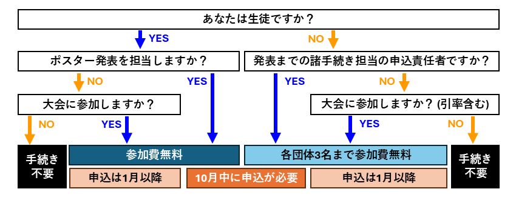
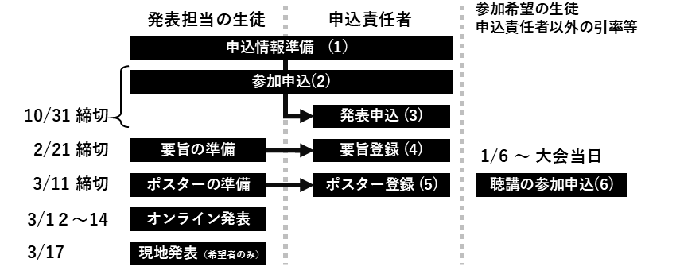

# ジュニアポスター (旧・高校生ポスター)

日本生態学会では、生態学の社会への普及・教育を目的として、高校生以下を対象とした研究発表の場として「**ジュニアポスター**」を設けています。本物の研究者達と肩を並べて、自身の研究内容について発表することができます。専門家と直接議論しアドバイスをもらう機会として、また、他の参加校と交流する機会として、ぜひご参加ください。

なお、高校生以下を対象とした企画として、活躍中の若手生態学者との交流会「[**みんなのジュニア生態学講座**](/juniorlec)」も開催予定です。自身が高校生、大学生だった頃を振り返りつつ、現在の研究に至った経緯などをお話しいただきます。こちらもぜひご参加ください。

## 概要

- 生き物の振る舞いや自然環境とのつながりなど、生態学に関する内容についてであれば、どのような題材発表でも歓迎です。
    - ただし、既に他学会等で発表された研究の場合、そこから発展した内容を含めてご発表ください。
- 小中高校（またはそれに相当する教育機関）の生徒が中心で行った研究である必要があります。
- 発表はポスター形式で行います。グループでの発表も可能です。
- 優れた内容のポスターはポスター賞として表彰します。詳細は[ポスター賞](#ポスター賞)をご覧ください。
    - ただし、ポスター賞に応募できるのは各団体最大２件までです。

### 場所・日時

オンラインと現地発表、二回の発表機会があります。

#### オンライン発表（全員参加）: 2025年3月12日（水）～ 14日（金）

- ポスターを大会プラットフォーム（発表用のWebサイト）にアップロードし、参加者が大会期間中に自由に閲覧する形式です。3月末頃まで掲示されます。
- コメント機能を利用した参加者との質疑応答のやり取りが可能です。Zoom等のオンライン会議システムを利用して、直接説明を行っても構いません。

#### 現地発表（希望者のみ）: 2025年3月16日（日）11:00～13:00

- ESJ73会場である国立京都国際会館に希望者はポスターを掲示して発表することができます。
- 現地発表では**コアタイム**（発表者が決まった時間に待機し、参加者からの質問にリアルタイムで対応する時間）が設定されます。コアタイム中は、自身のポスターの前で議論や交流を行ってください。

### 参加費

- ジュニアポスターにおいて**発表する生徒の参加費は無料**です。
- 生態学会は**参加のみの場合も大学学部生以下の生徒は無料**です。発表しない生徒の方も、ぜひご参加ください。
- 引率の顧問や担任の教員、保護者、外部協力者等**生徒以外も各団体あたり3名まで無料枠**があります。
    - ただし、申込責任者は、現地参加の有無に関わらず無料枠の一人としてカウントします。
    - 発表者として登録されている教員や外部協力者等の方も、本大会からは無料枠を使用しての参加となります。
    - 4人目以降の引率者は、参加費をお支払いただく必要があります。

## 発表までに必要な手続き

**発表までに必要な手続きは、顧問や担任の教員または保護者の方（以下「申込責任者」）が行ってください**。なお申込責任者は、各団体あたり3名の無料参加枠の一人としてカウントされます。必ずしも申込責任者が引率のために参加する必要はありませんが、残る団体ごとの無料参加枠は2名となる点にご留意ください。

以下の手順に従って、[講演申込みサイト](リンク)から発表の申し込み、要旨登録、参加手続き等を行ってください。

### \(1\) 申込情報の準備（発表担当の生徒・申込責任者）

申し込みの前に、以下の点についてご準備ください。

- **発表タイトル**：発表する研究の特徴や独自性を簡潔かつ正確に表現したものが好ましいです。[過去の生態学会の発表](https://esj.ne.jp/meeting/abst/index.html)を参考に決めてください。日本語（全角40字以内）と英語（半角150字以内）、両方のタイトルが必要です。
- **発表者の氏名・所属**：ここでいう「発表者」とは、ポスターの解説を行う発表担当の生徒のことではなく、発表する研究において重要な貢献をした全ての人を指します。[研究への貢献の考え方](#参考：研究への貢献の考え方)を参考に、発表者を決めてください。氏名・所属は日本語、英語両方の表記が必要です。
- **代表発表者**：発表者のうち一人を代表発表者として登録する必要があります。
- 発表者全員が生態学会で発表することに同意していることを確認してください。全員の同意がなければ発表することはできません。

### \(2\) 参加申し込み（発表担当の生徒・申込責任者）

締切：**2024年10月31日(金) 23:59**

オンラインまたは現地で発表担当の生徒および申込責任者は、全員各種申し込みサイトから参加申し込みを行ってください。

1. [ESJ73の各種申込フォーム](リンク)を開き、種別を「非会員/ジュニアポスター」→「新規申し込み」の順に選び、氏名、メールアドレス、パスワードを入力してください。登録が済むと、ログインIDがメールアドレス宛に送信されます。
2. 再び[ESJ73の各種申込フォーム](リンク)を開き、「非会員/ジュニアポスター」→「各種申込/変更/確認」の順に選び、ログインIDとパスワードを入力してログインしてください。
3. 入力フォームに従って参加者情報を登録してください。
    - 登録後、参加費の支払い欄が「未済」となりますが、特に操作しなくてかまいません。
    - 画面下部に「ジュニアポスターの新規講演申込」ボタンが表示されますが、申込責任者以外は操作しないでください。

### \(3\) 発表申し込み（申込責任者）

締切：**2024年10月31日(金) 23:59**  
※申込多数の場合、締切までに募集を打ち切る場合があります。

1. 申込責任者は[ESJ73の各種申込フォーム](リンク)を開き、「非会員/ジュニアポスター」→「各種申込/変更/確認」の順に選び、ログインIDとパスワードを入力してログインしてください。
2. ログイン後、画面下部に「ジュニアポスターの新規講演申込」ボタンが表示されます。クリックし、入力フォームに従ってポスター賞への応募の有無、現地参加の予定、発表タイトル、発表者全員分の氏名、所属、メールアドレス等を登録してください。
    - 現地参加を希望する全ての発表者、大会プラットフォームへのログインを希望する全ての発表者については、メールアドレスを必ずご登録ください。
    - 入力内容を十分ご確認の上、申し込みを行ってください。申し込み締切後は、一切の登録内容の修正ができません。正誤表による修正も受け付けていません。締め切り前であれば、何度でも修正可能です。
3. 複数の発表を登録する場合は、3の手順を繰り返してください。ただし、以下の点にご注意ください。
    - 同一人物が複数の発表における「代表発表者」となることはできません。
    - 同一団体からの発表のうち「ポスター賞へ応募する」を選べるのは最大2件までです。

### \(4\) 要旨の登録（申込責任者）

締切：**2025年2月21日(金) 23:59**

研究の背景、目的、方法、結果、考察等を簡潔にまとめた発表要旨（日本語のみ、800字以内）をご登録ください。要旨については、[過去の生態学会の発表](https://esj.ne.jp/meeting/abst/index.html)を参考にご準備ください。

1. 申込責任者は[ESJ73の各種申込フォーム](リンク)を開き、「非会員/ジュニアポスター」→「各種申込/変更/確認」の順に選び、ログインIDとパスワードを入力してログインしてください。
2. 画面下部に要旨登録のボタンが表示されますので、入力フォームに従って登録してください。

### \(5\) 大会プラットフォームへのポスターの登録（申込責任者）

登録期間：**2025年1月6日（月）～3月11日（月）23:59**

作成したポスターはPDFに変換の上、大会プラットフォームへアップロードしてください。

1. 申込責任者へは、1月頃に大会プラットフォーム（オンライン発表用のWebサイト）へのログイン情報がメールアドレス宛に送信されますので、ログインしてください。
2. 大会プラットフォームのホーム画面における「発表・プロフィールを登録する」を選び、ポスターとグラフィカルアブストラクト（後述）、必要に応じて説明動画をアップロードしてください。

### \(6\) 参加のみの生徒、申込責任者以外の引率者等の参加登録（該当者各自）

登録期間：**1月6日～大会当日まで手続き可能**

発表者および申込責任者以外の参加者は、以下から各自で参加登録を行ってください。無料枠を超える引率者の方については、一般参加者として参加登録を行ってください。

【大会プラットフォーム】（準備中：1月頃に立ち上げ予定）

## 発表にあたって

### ポスターの準備

- ポスターの形式は「A4サイズ横向き×4枚」を推奨していますが、基本的に制約はありません。現地発表で一般的な「A0サイズ縦向き×1枚」で作成してもかまいません。
    - オンライン発表ではPDF形式でアップロードします。
    - 現地発表では、縦210cm×横90cmの縦ボードに掲示します。ボードをはみ出して掲示することはできません。
- ポスターには、発表者全員分の[研究への貢献内容](#参考：研究への貢献の考え方)を明記してください。ポスターの下部や最後のページ等、目立たない所でもかまいません
- 研究内容を1枚の図で視覚的に表した「グラフィカルアブストラクト」（1200 pixel x 1200 pixel のJPEG画像）を必ず作成してください。
    - 内容は自由です。研究内容を要約したイラストや図表、研究対象生物の写真でも構いません。聴衆が「発表を聞いてみたい」と思うような、アイキャッチとなるものであることが重要です。
    - 大会プラットフォーム上でサムネイルとして使用されるため、あまり細かな文字や図表は避けてください。

### オンライン発表 (全員)

- ポスターのアップロードは申込責任者が行います。期限までに、大会プラットフォームへポスターとグラフィカルアブストラクトをアップロードしてください。
- 説明動画もアップロード可能です。アップロード自体は任意ですが、現地参加しない場合はアップロードを推奨します。
- オンライン発表でのコアタイム（発表者が決まった時間に待機し、参加者からの質問にリアルタイムで対応する時間）はありません。オンライン上で直接説明をしたい場合には、各自でZoomなどのオンライン会議システムをご利用ください。
- 期間中、大会プラットフォーム上で待機いただく必要はありませんが、参加者からコメント機能を用いた質問等が寄せられることがあります。必要に応じてご確認・ご返信ください。
- 発表方法やファイルのアップロード方法の詳細については、[オンラインポスター発表の方法](presentation#オンラインポスターの発表方法)もご参照ください。

### 現地会場での発表 (希望者)

- メールアドレスを登録した発表者には、大会プラットフォームへのログイン情報が例年1月頃に送信されます。ログイン後、自身の名札をあらかじめ印刷し、当日持参してください。ネームホルダーは会場に用意されています。
- ポスターの掲示は、3月16日（土）の10:00から可能です。ポスターの撤去は、3月16日（土）の15:00までに行ってください。
- ポスターを貼るための画鋲は持参してください。例年、会場周辺の店舗では品薄になりますので、ご注意ください。
- 現地会場のコアタイムは以下の通りです。コアタイム中、発表者は自身のポスターの前で議論や交流を行ってください。
    - 奇数ポスター（11:00～11:30、 12:00～12:30）
    - 偶数ポスター（11:30～12:00、 12:30～13:00）

## ポスター賞

- オンライン発表の期間中にポスター賞の審査を行います。
- 期日までに大会プラットフォームにアップロードされなかったポスターは、審査対象となりません。
- 審査は以下の5つの審査項目で、ポスター本体を対象に行われます。
    1. 研究の新規性・独自性
    2. 手法と解釈の適切さ
    3. データの質・量
    4. 論理の妥当性
    5. 情報を伝える工夫・配慮
- また、豊かな発想や研究活動へのひたむきな努力が見られるポスター等を対象に、審査員特別賞を選定します。
- Zoom等を活用した説明や動画は審査の補助にはなりますが、直接の審査対象とはなりません。一見してわかりやすいポスター作成を心がけてください。

## お問い合わせ

ジュニアポスターについてのお問い合わせは、大会公式ホームページの[問い合わせフォーム](contact)をご利用ください。

## 参考：研究への貢献の考え方

科学の分野では、研究成果の発表時には**オーサーシップ**と呼ばれる「誰がどのように研究に貢献したか」を明記するのが一般的です。これは、研究に関わった人々の役割を正しく伝えるための大切なルールです。

ジュニアポスターでは、各発表者がどのような役割を担ったかを明記することをルールとしています。発表者（＝ポスターや論文に名前が載る人）として認められるのは、次のような形で研究に貢献をした全ての人です。

- 研究テーマの立案や研究計画の設計
- 実験や観察の実施、データの収集
- データの解析や統計処理
- 結果の解釈や考察の議論
- 発表資料の作成や発表準備
- 実験や研究活動の補助、技術的・学術的な指導
- 特殊な実験技術や設備の提供、技術指導

貢献内容ごとに誰が貢献したかを、ポスターには表記してください。発表者に含まれる全員が、なんらかの項目で貢献していることが必要です。研究の進め方によっては、生徒だけでなく、顧問の先生や外部の大学教員などが発表者に含まれることもあります。

上記の貢献の分類はあくまで一例なので、研究内容の実態に合わせて、適宜変更して構いません。いくつか具体的な例を見てみましょう。

例1：**生徒A**、**生徒B**が主体的にテーマを考え、**顧問教員X**の助言を受けながら研究計画を立てた。**生徒A**、**生徒B**が中心となって野外調査を通してデータを集め、結果の考察を進めた。**生徒C**、**生徒D**は野外調査に協力・貢献した。  
→ 4人の生徒と顧問教員が発表者に該当します。

    = 貢献の表記の例 =
    研究の構想・設計：生徒A、生徒B、顧問教員X
    データの収集：生徒A、生徒B、生徒C、生徒D
    データの解析・考察・発表準備：生徒A、生徒B

例2：**生徒A**が研究テーマを構想し、**大学教員Y**の技術指導のもとで実験を行った。**生徒B、生徒C**も実験を手伝った。**生徒D**は統計解析を担当した。結果の考察や発表準備には4人の生徒とともに**顧問X**も加わった。  
→ 3人の生徒、顧問教員、大学教員の全員が発表者に該当します。

    = 貢献の表記の例 =
    研究の構想・設計：生徒A
    実験の実施：生徒A、生徒B、生徒C
    統計解析：生徒D
    結果の考察・発表準備：生徒A、生徒B、生徒C、生徒D、顧問教員X
    技術的指導・設備提供：大学教員Y

例3：研究テーマの設定から実験、考察、発表準備までを**生徒A、生徒B**が主体的に行った。**顧問教員X**は部室の使用や機材の使用についての一般的なアドバイスを行った。  
→ 生徒A,Bのみが発表者に該当します。

    = 貢献の表記の例 =
    研究の構想・設計、実験、考察、発表準備：生徒A、生徒B

例4：**生徒A**が実験とデータ収集を行った。外部の**大学教員X**が一部の高度なデータ解析を担当し、結果の考察でも助言を行った。**顧問教員Y**は大学訪問時に付き添った。  
→ 生徒Aと大学教員Xが発表者に該当します。

    = 貢献の表記の例 =
    研究の構想・設計・実験・データ収集：生徒A
    データ解析、結果の考察：生徒A、大学教員X

「助言」や「手伝い」については、どの程度の貢献があれば発表者に含めるべきかに関しては、実は普遍的なルールはありません。ただ、一般的には「研究への知的貢献があるか」「研究の質に影響する貢献であるか」などが考慮されます。発表者に相当しないと判断される場合でも、「謝辞」として様々な支援や協力者への感謝の気持ちを記載することもできます。

学会発表は、研究成果を伝えるだけでなく、自分たちの活動を客観的に振り返る良い機会でもあります。その研究成果を貢献してくれたのか、発表者には議論・整理してみましょう。
