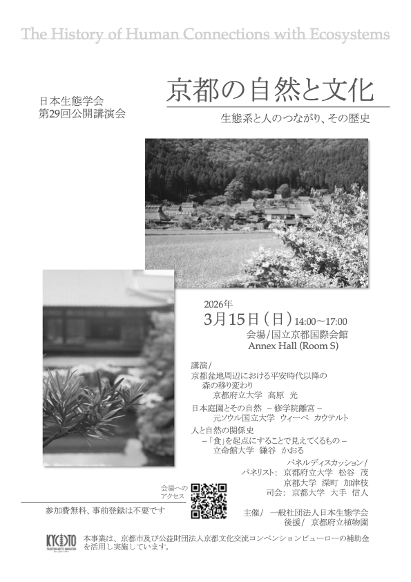
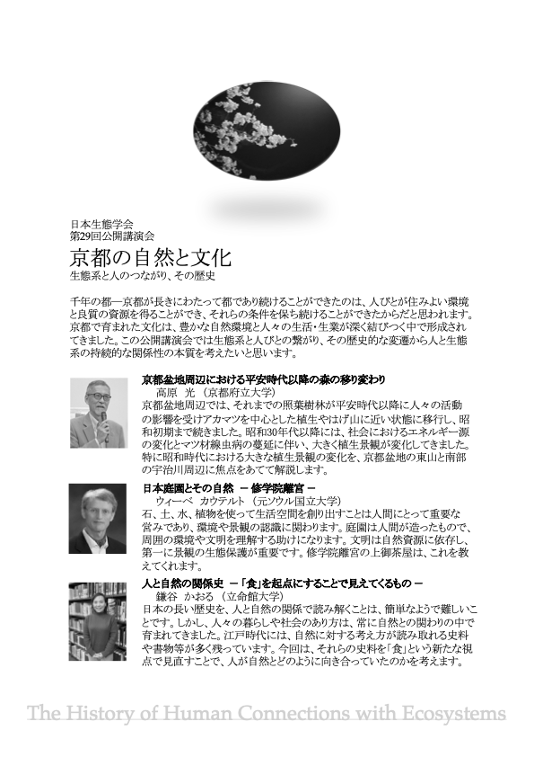

<!--実行委員会担当者様

執筆についてご案内です。

・markdown形式の細かい書き方は、説明ページ（https://github.com/hmito/esj72web/blob/main/docs/esj_web_markdown.md）をご覧ください。
・情報の準備が間に合わなければ、年明け以降の更新に先延ばしいただいてもかまいませんが、Web担当者の負担軽減のため、できれば一斉更新に間に合わせていただけると助かります。
・構成原案はあくまで参考ですので、適宜情報が伝わりやすいよう、情報の取捨選択も含めて編集をお願いします。
・英語版の作成もお願いいたします。
・提出はSlackのWeb更新依頼チャンネルからお願いします。なお、チャンネルに参加されていない場合は、運営部会宛にメールでご提出ください。

お手数おかけしますが、何卒よろしくお願いいたします。
-->

# 公開講演会

## 京都の自然と文化　生態系と人のつながり、その歴史

千年の都―京都が長きにわたって都であり続けることができたのは、人びとが住みよい環境と良質の資源を得ることができ、それらの条件を保ち続けることができたからだと思われます。京都で育まれた文化は、豊かな自然環境と人々の生活・生業が深く結びつく中で形成されてきました。この公開講演会では生態系と人びとの繋がり、その歴史的な変遷から人と生態系の持続的な関係性の本質を考えたいと思います。

**日時**：2026年3月15日(日) 14:00 – 17:00  
**場所**：国立京都国際会館　Anex Hall (Room S)  
**参加費**：無料、事前登録不要  

## ポスター

<!--元の記載
  
  -->

[ポスター(PDF)をダウンロード](./media/public_lecture_poster.pdf)
<!--リンクこれで大丈夫でしょうか？-->

## 会場

会場へのアクセスは[こちら](/venue#会場へのアクセス)を参考にして下さい。

## プログラム

<table>
<colgroup>
<col style="width: 6%" />
<col style="width: 93%" />
</colgroup>
<thead>
<tr class="header">
<th><strong></strong></th>
<th><strong>発表者／発表タイトル</strong></th>
</tr>
</thead>
<tbody>
<tr class="odd">
<td>1</td>
<td>高原　光（京都府立大学） 
京都盆地周辺における平安時代以降の森の移り変わり</td>
</tr>
<tr class="even">
<td>2</td>
<td>ウィーベ　カウテルト（元ソウル国立大学） 
日本庭園とその自然　ー 修学院離宮 ー</td>
</tr>
<tr class="odd">
<td>3</td>
<td>鎌谷　かおる（立命館大学） 
人と自然の関係史　ー「食」を起点にすることで見えてくるもの ー</td>
</tr>
<tr class="even">
<td>4</td>
<td>パネルディスカッション 
松谷　茂（京都府立大学） 
深町　加津枝（京都大学） 
</td>
</tr>
</tbody>
</table>

**企画** 日本生態学会京都大会実行委員会  

**主催**：一般社団法人日本生態学会  
**後援**：京都府立植物園