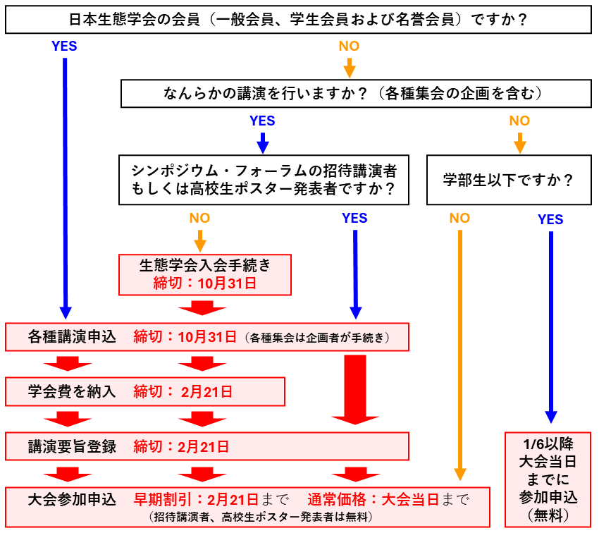

# 各種申込み概要

- **[一般講演](regist_oralposter)、[シンポジウム](regist_session\#シンポジウム)、[自由集会](regist_session\#自由集会)の講演申込はすべて締め切りました。多数の登録ありがとうございました。現在は要旨登録を[【各種講演申込みサイト】](https://iap-jp.org/esj/conf/login.php)で受付中です（締切：2025年2月21日（金）23時59分）**
- 講演をともなわない大会参加は随時受付中です。[大会プラットフォーム【ONLINE CONF】](https://esj72.gakkai.online/)からお手続きください。

****

## 重要な締め切り日

||**2024年10月31日（木） 23時59分まで**|**2025年2月21日（金） 23時59分まで**|**大会当日まで可能**|
|:---:|---|---|---|
|[**大会参加に必要な手続き**](#大会参加申込み)||早期割引価格参加申込み 　一般：17000円 　学生：8500円|通常価格参加申込み 　一般：19000円 　学生：9500円|
|[**各種講演に必要な手続き**](#各種講演申込み)|各種講演申込み締切|講演要旨登録締切||
|[**非会員の生態学会への 新規入会手続き**](#生態学会への新規入会手続き)|生態学会新規入会手続き|2025年学会費入金締切||

- シンポジウムの招待講演者、高校生ポスター発表者、企画・講演を行わない学部生・中高生は無料で参加できます。
  - フォーラムの招待講演者は当該フォーラムに限り無料で参加可能です。他の企画・集会等に参加される場合は大会参加費をお支払いください。
- 2024年12月1日から2025年1月5日までは、システム移行のため大会参加申込みができません。
- 2023年から学会費が未納の会員は、納付が確認できるまで[各種申込み手続きができません](#2023年から学会費未納の場合各種手続きができません)。**講演申込み締切の一週間前**には納入いただきますようお願いいたします。
  - 学会費の納入状況は [【マイページ】](https://iap-jp.org/esj/mypage/login/login) からご確認ください。

## 大会参加申込み
以下のページから大会参加申込みが可能です。

**[【大会プラットフォーム【ONLINE CONF】へ】](https://esj72.gakkai.online/)**

||早期申込み 2/21まで|通常申込み 2/22以降|
|---|---|---|
|**一般**|17000円|19000円|
|**学生**|8500円|9500円|
|**招待講演者、高校生ポスター発表者 講演のない学部生・中高生**|無料|無料|

- 大会参加申込みと参加費支払い手続きは、時期により利用するシステムが異なります。
  - 2024年11月30日までは大会申込みサイト、2025年1月6日以降は大会プラットフォーム（ONLINE CONF）を利用します。
  - 2024年12月1日〜2025年1月5日はシステム移行のため、参加申込み・参加費の支払いは行なえません。  
  - 参加申込みと支払いを別の時期に別のシステムで行なっても問題ありません。
- 大会参加費を支払わなければ、ポスターの閲覧やアップロードができません。できる限り大会当日までに大会参加申込みと参加費の支払手続きを完了してください。
- 非会員の方でも、聴講者としてご参加いただけます。
  - 大学学部学生以下（中・高校生を含む）の聴講のみの大会参加費は「無料」です。2025年1月6日以降に大会プラットフォーム上から大会参加申込みをなってください。
  - 上記に該当しない場合は、参加費をお支払いください。
- 高校生ポスター発表会での発表者、共著者、2名までの引率者は参加費無料です。また、「みんなのジュニア生態学」も無料でご参加いただけます。詳しくは、[高校生向け企画](junior)の案内をご覧下さい。
- [その他の注意点](#その他注意点)もご確認ください。

## 各種講演申込み
以下のページから各種講演申込みが可能です。各講演についての説明（下記表のリンク）および[その他の注意点](#その他注意点)もご確認の上、申込みを行ってください。

**[【各種講演申込みサイトへ】](https://iap-jp.org/esj/conf/login.php)**

<table>
  <colgroup>
  <col style="width: 20%" />
  <col style="width: 40%" />
  <col style="width: 40%" />
  </colgroup>
  <thead><tr class="header">
  <th>講演種別</th>
  <th><strong>申込締切</strong></th>
  <th><strong>要旨締切</strong></th>
  </tr></thead>
  <tbody>
  <tr class="odd">
    <td><a href = "opensession">公募セッション</a></td>
    <td><s>2024年7月31日 (水) 23:59</s></td>
    <td rowspan=7>2025年2月21日 (金) 23:59</td>
  </tr>
  <tr class="even">
    <td><a href = "ersympo">ERシンポジウム</a></td>
    <td><s>2024年8月30日 (金) 23:59</s></td>
  </tr>
  <tr class="odd">
    <td><a href = "regist_session/#フォーラム">フォーラム</a></td>
    <td><s>2024年9月15日 (日) 23:59</s></td>
  </tr>
  <tr class="even">
    <td><a href = "regist_session/#シンポジウム">シンポジウム</a> 
    <td rowspan=4>2024年10月31日 (木) 23:59</td>
  </tr>
  <tr class="odd">
    <td><a href = "regist_session/#自由集会">自由集会</a></td>
  </tr>
  <tr class="even">
   <td><a href = "regist_oralposter">一般講演</a> 
  </tr>
  <tr class="odd">
    <td><a href = "junior">高校生ポスター</a></td>
  </tr>
  </tbody>
</table>

- 各締切日の17:00〜翌日10:00はお問い合わせに対応できません。各種手順の確認はお早めにお願いします。
- すべての締切に関して、締切後の追加や修正等の依頼には対応できません。
- 申込みに際しては、[その他の注意点](#その他注意点)もご確認ください。

### 重複制限
大会での講演には、重複制限が設けられています。

- 重複制限がかかるのは複数の集会・講演の企画者・講演者となる場合のみです。講演を行わない「共同発表者」となることに対する制約はありません。
- シンポジウム企画者・講演者は、他のシンポジウム、自由集会、一般講演の企画者・講演者となることはできません。
  - ただし、要旨登録を伴わない趣旨説明やコメンテータ・意見表明は、講演の重複制限の対象とはなりません。
- 自由集会企画者・講演者は、一般講演の講演者となることはできます。
- フォーラムの企画者・話題提供者は重複講演制限の対象となりません。

||一般講演|シンポジウム|自由集会|フォーラム|
|:---:|:---:|:---:|:---:|:---:|
|一般講演|×|×|〇|〇|
|シンポジウム|×|×|×|〇|
|自由集会|〇|×|×|〇|
|フォーラム|〇|〇|〇|〇|

※ すでに各行の種別の企画者・講演者となっている場合、×で表示されている列の種別で新たに企画者・講演者になることはできません。

### 会員種別ごとの講演資格
大会での講演は原則として会員（正会員および名誉会員）に限ります。非会員の方が講演可能なのは以下の3つのケースです。

- シンポジウムで招待講演者として講演する場合
- シンポジウム・自由集会において、要旨登録を伴わないコメンテータ・意見表明者として参加する場合
- 高校生が高校生ポスターにおいて講演する場合

| **講演種別**                                      | **会員 ※1** | **非会員** |
|---------------------------------------------------|:-------------:|:------------:|
| 一般講演（口頭発表・ポスター発表） ※2             | ◯           |            |
| シンポジウム・自由集会の企画                 | ◯           |            |
| シンポジウムでの講演 ※2                           | ◯           | ◯ ※3      |
| 自由集会での講演 ※2                               | ◯           |            |
| シンポジウム・自由集会のコメンテータ・意見表明| ◯           | ◯          |
| 高校生ポスターとしての講演                          | ◯           | ◯ ※4      |

※1　日本生態学会の正会員（一般・学生）および名誉会員を指します。賛助会員は含まれません。  
※2　講演の主たる発表者を意味します。共同発表者は会員である必要はありません。  
※3　招待講演者に限ります。
※4　高校生以下に限ります。

## 生態学会への新規入会手続き

非会員の方は、[一部の例外](#会員種別ごとの講演資格)を除いて各種講演を行うことができません。例外に該当しない非会員の方は、**各種申込みに先立って生態学会への入会手続き**を行う必要があります。入会手続きには時間を要する場合がありますので、余裕を持って手続きをお済ませください。

**[【生態学会新規入会手続きサイトへ】](https://www.esj.ne.jp/esj/Nyukai.html#Join)**

1. 上記リンクから新規入会手続きを行ってください。
2. 入会申込みが確認でき次第、会員業務窓口より仮会員番号を通知します。
3. 仮会員番号を用いて集会および講演の申込みを行なってください。
4. 後日郵送されてくる「請求書」に付属する払込用紙にて学会費をお支払いください。

## その他注意点

### 2023年から学会費未納の場合各種手続きができません

2023年から年会費が未納の方は、2023年分の会費のご納入を窓口で確認できるまでは、2025年大会での講演申込みも出来ない状況となります。入金を窓口で確認しステータスの更新を行うまでは発表申込みができませんので、**講演申込み締切の一週間前**には会費の納入を済ませていただけますようお願いいたします。

なお、会費の納入状況の確認は[マイページ](https://iap-jp.org/esj/mypage/login/login)からご確認ください。

### 自由集会のみへの参加枠の廃止について

これまでESJの大会では、参加申し込みに「自由集会のみ聴講」のカテゴリーを設けておりました。しかし、自由集会の開催には少なくない運営経費が必要であることや、過去数年間においてこのカテゴリーでの参加申し込み者が少数であったことなどの事情を考慮し、理事会での議論を経て、ESJ72では「自由集会のみ聴講」のカテゴリーを廃止することとしました。自由集会のみの聴講を希望される方も、恐れ入りますが通常枠での大会参加手続きをお願いいたします。

### 参加証・領収書の発行

参加証・領収書は大会申込みイトではなく大会プラットフォームONLINE CONFから発行されます。印刷物での送付はありませんのでご注意ください。ONLINE CONFが公開される2025年1月6日以降にダウンロード可能となります。なお、領収書に記載されている金額は会員（一般・学生とも）の場合は不課税（課税対象外）、非会員の場合は税込み金額（課税対象）となっております。また、参加費用は研究発表・集会に参加するための費用になります。ランチ、懇親会代等は含まれておりません。

本学会は適格請求書発行事業者に**登録しておりません**ので、インボイスの発行は承りかねます。

参加費の公費支払い（請求書払いなど）をご希望の場合、まずは参加申込を行ってください。決済方法として「郵便振替」をご選択の上、申し込みを完了した上で、問い合わせページにてお問合せください。なお、支払いは前払いにてお願いしております。

### 正誤表の廃止

本大会では講演申込みや企画提案後の正誤表による修正を受け付けません。申込み講演要旨提出時に、内容に誤りがないか十分にご確認ください。特に学会参加経験の少ない学生は、タイトルや発表者情報などについて、指導教員などと十分に相談の上、お申込みください。

### キャンセルポリシー

本大会における参加費の返金期限は2025年2月21日です。この日までに参加取消の申し出があった場合は、振込手数料等の経費を除き返金いたします。[問い合わせページ](contact)から大会企画委員会にご連絡ください。

返金期限経過後は、原則として返金いたしません。予めご了承ください。

### ESJ72において講演できなかった際の研究成果の取扱

講演要旨を登録の上、期日までに大会参加費を支払った講演者は、以下の事由により講演できなかった場合でも、本学会大会講演要旨を公開しているウェブページ上の講演情報および要旨を本学会が業績として認めます。

- 火災、地震、気象災害、人災、感染症などによる大会の中止
- 大会プラットフォームの障害や大規模なネットワークの障害 

 ただし、大会参加費を期日までに支払わなかった場合、本学会大会講演要旨を公開しているウェブページから講演情報および要旨を削除し、プログラムに記載があったとしても、当該研究は業績として認定しません。
