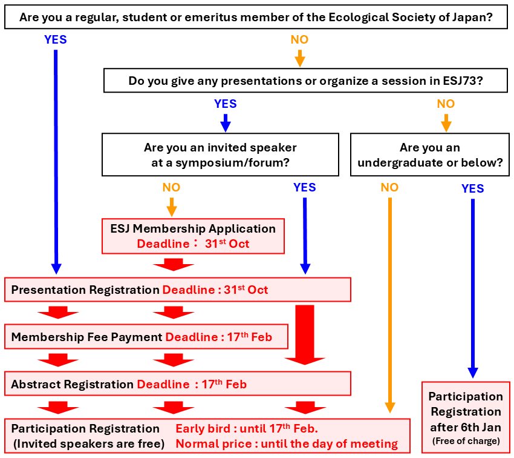

# Registrations and Proposals

- **Applications for [Regular Presentations](regist_oralposter_en), [Symposia](regist_session_en#symposium), and [Workshops](regist_session_en#workshop) is closed. Thank you very much for your registration. Abstract registration is now open at [[Applications site]](https://iap-jp.org/esj/conf/login_en.php) (deadline: 21st Feb. 2025, 23:59 (JST)).**
- Registration for the conference without a lecture is open at any time. Please access to [the ESJ72 Platform [ONLINE CONF]](https://esj72.gakkai.online/).

Important deadlines are as follows.

||**Thursday, 31st Oct. 2024  23:59 (JST)**|**Friday, 21st Feb. 2024  23:59 (JST)**|**On-site**|
|---|---|---|---|
|[**Procedures for participation in the conference**](#registration-for-participation)||Early bird registration 　Regular：17000 JPY 　Student：8500 JPY|Normal price registration 　Regular：19000 JPY 　Student：9500 JPY|
|[**Procedures for Presentations**](#proposals-for-presentations-and-sessions)|Deadline for Proposals|Deadline for Abstract Submission||
|[**Non-members joining the ESJ for presentations**](#procedure-for-new-membership-to-the-ecological-society-of-japan)|Deadline for new members to join the ESJ|Deadline for payment of membership fee for 2025||

- Invited speakers at symposia, and undergraduate or below who is not organizer and speaker can participate without registration fee.
  - Invited speakers at forum may participate in the forum without registration fee, but those who wish to participate in other sessions or meetings are required to pay the conference registration fee.
- Due to system transition, registrations will not be available from December 1, 2024 to January 5, 2025.
- Members who have not paid the membership fee from 2023 will <a href = "registinfo_en/#If_you_have_not_paid_the_membership_fee_from_2023_you_will_not_be_able_to_complete_any_procedures"> not be able to complete the registration and application procedures</a> until payment is confirmed. Please pay the membership fee, at least, one week before the deadline.
  - You can check the payment status of the membership fee from [My Page](https://iap-jp.org/esj/mypage/login/login).

## Registration for Participation
You can register for the conference participation at the below link.

**[[Go to the ESJ72 Platform [ONLINE CONF]]](https://esj72.gakkai.online/)**

||Early bird until 21st Feb.|Normal price after 22nd Feb.|
|---|---|---|
|**Regular**|17000 JPY|19000 JPY|
|**Student**|8500 JPY|9500 JPY|
|**Invited speaker  undergraduate or below without presentation**|Free|Free|

- The system used for the registration and payment procedures differs depending on the period.
  - The application website will be used until 30th Nov. 2024, and the conference platform (ONLINE CONF) will be used after 6th Jan. 2025.
  - Due to system transition, registrations will not be available from 1st Dec. 2024 to 5th Jan. 2025.
- Please complete the registration and payment procedures as far as possible before the day of the conference.
  - You will not be able to view or upload posters without paying the registration fee.
- Non-members are welcome to attend the conference as audience if they pay the registration fee.
  - The registration fee is “free” for university undergraduates and below (including junior high and high school students) as audience, who can register on the conference platform after 6th Jan. 2025.
  - If none of the above apply, please pay the registration fee.
- Please also read [Other Notes](#other-notes) when registering.

## Proposals for Presentations and Sessions
You can apply for Regular Presentations, Symposia, and Workshops at the Application site.
Please read the description of each session (links in the table below) and [Other Notes](#other-notes) before applications.

**[[Go to Application site]](https://iap-jp.org/esj/conf/login_en.php)**

<table>
  <colgroup>
    <col style="width: 20%" />
    <col style="width: 40%" />
    <col style="width: 40%" />
  </colgroup>
  <thead><tr class="header">
    <th>Session type</th>
    <th><strong>Application Deadline</strong></th>
    <th><strong>Abstract Submission Deadline</strong></th>
    </tr></thead>
  <tbody>
    <tr class="odd">
      <td><a href = "opensession">Open Session</a></td>
      <td><s>Wednesday, 31st Jul. 2024 23:59 (JST)</s></td>
      <td rowspan=7>Friday, 21st Feb. 2025 23:59 (JST)</td>
    </tr>
    <tr class="even">
      <td><a href = "ersympo_en">ER Symposium</a></td>
      <td><s>Friday, 30th Aug. 2024 23:59 (JST)</s></td>
    </tr>
    <tr class="odd">
      <td><a href = "regist_session_en/#Forum">Forum</a></td>
      <td><s>Sunday, 15th Sep. 2024 23:59 (JST)</s></td>
    </tr>
    <tr class="even">
      <td><a href = "regist_session_en/#Symposium">Symposium</a> 
      <td rowspan=4><s>Thursday, 31st Oct. 2024 23:59 (JST)</s></td>
    </tr>
    <tr class="odd">
      <td><a href = "regist_session_en/#Workshop">Workshop</a></td>
    </tr>
    <tr class="even">
     <td><a href = "regist_oralposter_en">Regular Presentation</a> 
    </tr>
  </tbody>
</table>

- We are unable to respond to inquiries from 17:00 to the next day 10:00 (JST) on each deadline. Please check various procedures as soon as possible.
- For all deadlines, we will not be able to respond to requests for additions, corrections, etc. after the deadline.
- Please also read [Other Notes](#other-notes) when applying.

### Overlap Restrictions
There are restrictions on overlapping presentations at the conference:

- Overlap restrictions apply only if you are already an organizer or speaker of a session or presentation. There is no restriction on being a co-author of a presentation.
- Symposium organizers/speakers cannot be organizers/speakers in other symposium, workshop, or regular presentations.
  - However, explanations of aim, comments, or statement of opinions without abstract submission is not subject to overlap restrictions.
- Workshop organizers/speakers can be regular presentation speakers.
- Forum organizers/topic providers are not subject to the overlap restrictions.

||Symposium|Workshop|Regular Presentation|Forum|
|:---:|:---:|:---:|:---:|:---:|
|Symposium|×|×|×|〇|
|Workshop|×|×|〇|〇|
|Regular Presentation|×|〇|×|〇|
|Forum|〇|〇|〇|〇|

※ If you are already an organizer or a speaker of the respective category, you cannot become an organizer or a speaker of the category marked with an "×".

### Presentation Eligibility by Membership Type
Presentations at the conference are generally limited to members (regular, student, and emeritus members). Non-members are eligible in the following two cases:

- When to speak as an invited speaker in symposium
- When participating as a commentator or opinion presenter in symposium/workshop without abstract submission.

| **Session type**                                      | **Member \*1** | **Non-member** |
|---------------------------------------------------|:-------------:|:------------:|
| Regular Presentation (Oral or Poster) \*2             | ◯           |            |
| Symposium/Workshop organizer                 | ◯           |            |
| Symposium presenter \*2                           | ◯           | ◯ \*3      |
| Workshop presenter \*2                               | ◯           |            |
| Commentator/Opinion in Symposium/Workshop| ◯           | ◯          |

\*1　Refers to regular, student or emeritus members of the Ecological Society of Japan. Associate members are not included.  
\*2　Refers to the primary presenter (speaker). Co-presenters do not need to be members.  
\*3　Limited to invited speakers.

## Procedure for new membership to the Ecological Society of Japan

Non-members are not eligible to present with [some exceptions](#presentation-eligibility-by-membership-type). Non-members who do not fall under any of the exceptions must **apply for membership in the Ecological Society of Japan prior to submitting registration and proposal**. The admission procedure may take some time, so please complete the procedure well in advance.

**[[Go to the ESJ membership application site]](https://www.esj.ne.jp/esj/English/join.html)**

1. Please follow the above link to complete the new membership application.
2. Upon confirmation of your application for membership, the Member Service Desk will notify you of your temporary membership number.
3. Please use your temporary membership number to register for the conference and presentation.

## Other Notes

### If you have not paid the membership fee from 2023, you will not be able to complete any procedures.

If you have not paid the membership fee from 2023, you will not be able to apply to speak at the 2025 conference until we can confirm payment of your 2023 membership fee. As you will not be able to submit your presentation until your payment is confirmed and your status is updated, please pay the membership fee, at least, one week before the deadline.

To check the status of your membership fee payment, please visit [My Page](https://iap-jp.org/esj/mypage/login/login).

### Abolition of Quota for Participation in Workshops Only

In the past, the ESJ conference has included a “Workshop Only Attendance” category in the registration process. However, taking into account the fact that the Workshop requires significant operating expenses and that only a few people have applied for this category in the past few years, the Board of Directors has decided to abolish the “Workshop Only Attendance” category for the ESJ72. We apologize for the inconvenience, but we ask that those who wish to attend only Workshops also follow the regular procedures to participate in the conference.

### Participation Certificates/Receipts

Participation certificates and receipts will be issued from the conference platform ONLINE CONF, not from the application site. Please note that printed copies will not be sent out and will be available for downloading after 6th Jan. 2025, when ONLINE CONF will be opened. Please note that the amount shown on the receipt is non-taxable for members (both regular and student) and taxable for non-members.　The participation fee covers the cost of attending the research presentations and meetings. Lunch and receptions are not included.

The Ecological Society of Japan is **not registered** as a Qualified Invoicing Business and cannot issue invoices.

If you wish to pay the registration fee publicly (e.g., by invoice payment), please apply for registration first. Next, please select “Postal Transfer” as the payment method, complete the application, and then contact us via the inquiry page. We ask that payment be made in advance.

### Abolition of Errata

The conference does not accept revisions based on errata after the presentation application or proposal has been submitted. Please make sure that there are no errors in the content when submitting your abstract. Students who have little experience in participating in academic meetings are especially encouraged to discuss the title and presenter information thoroughly with their academic advisors before submitting their abstracts.

### Cancellation Policy

If a cancellation request is received before the refund deadline for each event (21st Feb. 2025 for this year's event), a refund will be made, excluding bank transfer fees and other expenses. In principle, no refunds will be made after the refund deadline has passed.

### Handling of research achievements when presentations cannot be given at ESJ72

Speakers who have registered their abstracts and paid the registration fee by the deadline will have their presentation information and abstracts recognized as achievements by the society on the web page where the abstracts are published, even if they were unable to present their presentations due to the following reasons.

- Cancellation of the conference due to fire, earthquake, weather, man-made disasters, infectious diseases, etc.
- Failure of conference platform or major network fault 

However, if the registration fee is not paid by the deadline, the presentation information and abstract will be removed from the web page where the abstracts are published, and the research concerned will not be recognized as an achievement, even if it is listed in the program.
