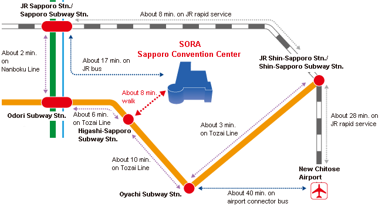

# Venue
All presentations will take place at the **Sapporo Convention Center** ([Website](https://www.sora-scc.jp/eng/)).

[\<Google Map\>](https://maps.app.goo.gl/3715B6bF2e5urKno8)

## Access

### From central Sapporo to the venue
To get to the Sapporo Convention Center from central Sapporo, take the Sapporo City Subway or JR Hokkaido Bus.

1. **Sapporo City Subway Tozai Line**  
	- The line runs east-west along the Odori Park in the centre of the city. It operates every 7 minutes during the day.
	- The venue is an 8-minute walk from Subway Higashi-Sapporo Station (T12) on Tozai Line. 
	- From the Susukino or Clock Tower area, it is roughly a 10-minute walk to Odori Station on the Tozai Line, from Odori Station take a train in the direction of Oyachi or Shin-Sapporo, the third stop is Higashi-Sapporo Station. The journey takes 6 minutes.
	- From the Sapporo Station or the Nakajima Koen, take the Namboku Line and transfer at Subway Odori Station.
2. **JR Hokkaido Bus**  
	- There are about four buses per hour during the day from the Sapporo Station and Clock Tower bus stop to Shin-Sapporo Station on the “Route 1” bus.
	- The venue is about a 6-minute walk from the Chuo 1-jo 1-chome bus stop on "Route 1" bus.
	- The ride from Sapporo Station to Chuo 1-jo 1-chome takes about 20 minutes.

### From New Chitose Airport to Sapporo
The venue can be accessed from New Chitose Airport via JR Sapporo Station (central Sapporo), JR Shin-Sapporo Station, or Subway Oyachi Station

1. **via JR Sapporo Station**  
	- From New Chitose Airport Station, you can take the JR rapid train or the airport shuttle bus to central Sapporo. 
	- The fastest rapid train takes 36 minutes to JR Sapporo Station. 
	- Two companies (Hokuto Kotsu and Hokkaido Chuo Bus) operate the airport shuttle bus service, which takes 40 to 80 minutes. Buses go via Odori. 
	- Subway or local buses are available from central Sapporo to the venue (see “From central Sapporo to the venue”).
2. **via JR Shin-Sapporo Station**  
	- Take the JR rapid train from New Chitose Airport Station and change to the subway at JR Shin-Sapporo Station. 
	- From Shin Sapporo Subway Station, take the Tozai Subway Line to Higashi-Sapporo Station (about 13 minutes). 
	- You can also take a local bus from Shin-Sapporo Station (JR Hokkaido Bus Route 1, about 29 minutes).
3. **via Subway Oyachi Station**  
	- From New Chitose Airport, take the airport shuttle bus (Oyachi Line) to Oyachi, then transfer to the subway. 
	- Buses to Oyachi leave once or twice an hour from Hokuto Kotsu and Chuo Bus, and the trip to Oyachi Station takes about 40 minutes. 
	- From Oyachi Station, take the Tozai Subway Line to Higashi-Sapporo Station, a 10-minute ride.

